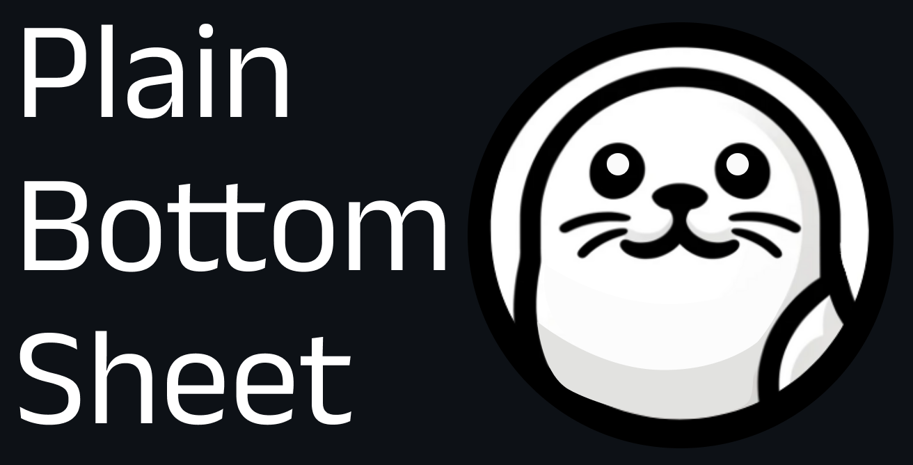

  

**Plain Bottom Sheet** is The **minimalistic**, **configurable** bottom-sheet for the Web developers.

> ⚛️ React Plain Bottom Sheet is on the way!

### [Check out our website](https://plain-bottom-sheet-pbs-docs.vercel.app/), for a quick start guide, APIs, examples, and more!

## Why?

### 🫙 Zero Dependencies

So your app does not depend on any other libraries that you don't need.

### ☁️ Super Lightweight(Only 7 kB, compressed)

So you don't have to compromise loading speed.

### 📱 Mobile-friendly

Works just like the native bottom sheet.

### 🎛 Highly Configurable

- Style it anyway you want, using CSS.
- Change its behaviors, on the fly.
- Hook into life-cycle events, and states.

### 🦮 Accessibility Support

Keyboard interactions and focus management works out-of-box.

### 🍰 Works Out of The Box

Without any configs.

### 🦾 Fully-typed

### ⚡️ Performant By Default
